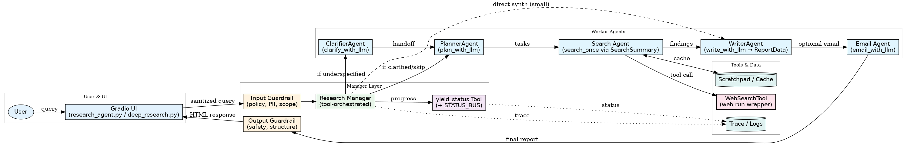

# Deep Research - Multi-Agent System (Gradio + OpenAI)

> An autonomous multi-agent research workflow that clarifies, plans, searches, and synthesizes reports into clean HTML or email-ready outputs.

🔗 **Live Demo (for demo use only):**  
👉 https://huggingface.co/spaces/AMIXXM/Deep_Research



---

## 🧠 Overview
**Deep Research** is a modular AI pipeline that coordinates multiple agents to perform structured, end-to-end research:
- **Clarifier Agent** – asks 3 key clarifying questions to refine ambiguous prompts.  
- **Planner Agent** – decomposes the query into targeted search tasks.  
- **Search Agent** – performs parallel searches and compiles summaries.  
- **Writer Agent** – synthesizes findings into a structured Markdown report.  
- **Email Agent** – (optional) converts the report into HTML and emails it.  
- **Manager Agent** – orchestrates all steps and streams real-time progress to the Gradio UI.

This project is designed for reproducibility, extensibility, and easy **self-hosted** deployment (no commercial Hugging Face usage required).

---

## ⚙️ Run Locally
```bash
git clone https://github.com/AmirMohaddesi/Deep_Research.git
cd Deep_Research
python -m venv .venv && source .venv/bin/activate   # Windows: .venv\Scripts\activate
pip install -r requirements.txt
cp .env.example .env
python deep_research.py
```

Then open **http://127.0.0.1:7860** in your browser.

---

## 🌍 Share Publicly with Gradio (Free)
You can deploy this app using Gradio’s built-in sharing feature — it provides a **temporary, secure public link** without using Hugging Face hosting.

1. In your launcher file (for example, `deep_research.py`), modify the last line:
   ```python
   ui.launch(share=True, server_name="0.0.0.0", server_port=7860)
   ```
2. Then run:
   ```bash
   python deep_research.py
   ```
3. Gradio will display a URL like:
   ```
   Running on local URL:  http://127.0.0.1:7860
   Running on public URL: https://1234abcd.gradio.live
   ```
   Share that public `.gradio.live` URL freely — it’s hosted by Gradio’s secure tunnel, not Hugging Face.

---

## 🖥️ Self-Host with Docker
You can also deploy your own containerized version for private or research use.

**Dockerfile example:**
```dockerfile
FROM python:3.11-slim
WORKDIR /app
COPY requirements.txt .
RUN pip install --no-cache-dir -r requirements.txt
COPY . .
ENV GRADIO_SERVER_NAME=0.0.0.0
EXPOSE 7860
CMD ["python", "deep_research.py"]
```

**Build and run:**
```bash
docker build -t deep-research .
docker run -p 7860:7860 --env-file .env deep-research
```

Open **http://localhost:7860** in your browser.

---

## ☁️ Cloud Run (One-Line Deploy)
If you have Google Cloud CLI installed, you can deploy directly:
```bash
gcloud run deploy deep-research \
  --source . \
  --region us-central1 \
  --allow-unauthenticated \
  --set-env-vars OPENAI_API_KEY=YOUR_KEY,SENDGRID_API_KEY=YOUR_KEY
```
You’ll get a public HTTPS URL after deployment.

---

## 🧩 Environment Variables
Set your API keys in `.env`:
```
OPENAI_API_KEY=sk-...
SENDGRID_API_KEY=...   # optional, for Email Agent
```

---

## 🧱 Architecture Summary
1. **User Input** → Clarifier Agent → Planner Agent  
2. **Planner Output** → parallel Search Agents → Writer Agent  
3. **Writer Output** → HTML Converter → (optional) Email Agent  
4. **Status** updates streamed through `yield_status`  
5. **Input/Output Guardrails** ensure safety and factuality  

---

## 💡 Example Use Cases
- Generating literature-style research briefs  
- Compiling multi-source analyses for startups or policy reports  
- Automated academic or technical landscape reviews  

---

## 👨‍💻 Author
**Seyed Amirhosein Mohaddesi**  
Ph.D. in Cognitive Robotics — UC Irvine  
🌐 https://amirmohaddesi.github.io • 🤗 https://huggingface.co/AMIXXM • 🧩 https://github.com/AmirMohaddesi

---

## 🪶 License
MIT License — free for research and commercial use.
